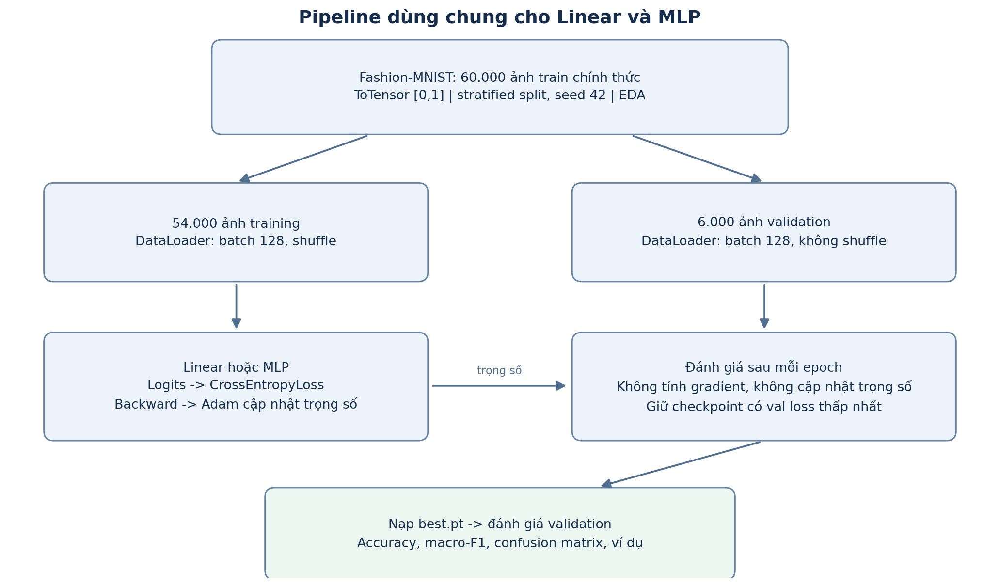

# Assignment 1 - M1 Draft

**Foundations of Deep Learning Pipelines and Architectures**

**Trường:** Trường Đại học Bách khoa, ĐHQG-HCM

**Khoa:** Khoa Khoa học và Kỹ thuật Máy tính

**Môn học:** Deep Learning and Its Applications - CO3133, học kỳ 261

**Giảng viên:** Lê Thành Sách

**Nhóm:** G-M10

| Thành viên | MSSV | Vai trò đã xác nhận |
|---|---|---|
| Trần Gia Lâm | 2352670 | Leader; thực hiện lần chạy Google Colab được cung cấp |
| Nguyễn Hữu Cầu | 2352129 | Thành viên; đóng góp thực tế ở M1 cần nhóm xác nhận |

**Phạm vi:** Bản nháp M1 gồm EDA, Dataset/DataLoader, train-validation loop, Linear và MLP trên Fashion-MNIST. Các kết quả chính lấy từ lần chạy Google Colab Tesla T4 trong thư mục outputs/a1_t4.

**Tình trạng bản thảo:** Nội dung đã được biên tập và đối chiếu kỹ thuật với file kết quả. Nhóm còn cần xác nhận phân công thực tế, việc rà soát nội dung cuối cùng và yêu cầu nộp riêng trên LMS; xem [bảng đối chiếu M1](DRAFT1_CHECKLIST.md).

**Tài liệu đi kèm:** [Bản HTML](G-M10_A1_Draft.html), [bản PDF](G-M10_A1_Draft.pdf), [bản ghi Colab](notebooks/A1_Colab_Run.ipynb), [nguồn gốc và kiểm chứng](COLAB_RUN.md), [AI usage](AI_USAGE.md).

## Phần 1. Bài toán và dữ liệu

### 1.1. Phát biểu bài toán

Với một ảnh xám của một sản phẩm thời trang, mô hình dự đoán một trong 10 lớp Fashion-MNIST. Đơn vị dự đoán là một ảnh; đầu vào có kích thước 1 x 28 x 28 và nhãn là một số nguyên từ 0 đến 9. Mô hình trả về 10 logits; lớp dự đoán là vị trí có logit lớn nhất.

Mục tiêu của thí nghiệm là xây dựng pipeline có thể chạy lại và kiểm tra liệu MLP một lớp ẩn có cải thiện kết quả validation so với bộ phân loại tuyến tính khi giữ cố định dữ liệu và quy trình huấn luyện. Đây là benchmark học thuật; kết quả hiện tại chưa kiểm chứng khả năng nhận diện ảnh sản phẩm thực tế.

### 1.2. Nguồn dữ liệu và cách chia tập

Fashion-MNIST do Zalando Research công bố, với giấy phép MIT [1]. Bộ dữ liệu có 60.000 ảnh train chính thức và 10.000 ảnh test chính thức; ảnh kích thước 28 x 28, một kênh. Mã nguồn dùng torchvision.datasets.FashionMNIST và tải dữ liệu IDX nén gzip từ bản HTTPS của tác giả; torchvision kiểm tra MD5 khi tải.

Tập train chính thức được chia bằng train_test_split với stratify theo nhãn, validation_size = 6.000 và seed = 42. Cả hai mô hình dùng cùng 54.000 chỉ số train và 6.000 chỉ số validation. Test chính thức giữ độc lập: chỉ đếm phân bố lớp phục vụ EDA, chưa đánh giá mô hình hay chọn siêu tham số bằng test.

| Lớp | Train | Validation | Test chính thức |
|---|---|---|---|
| T-shirt/top | 5,400 | 600 | 1,000 |
| Trouser | 5,400 | 600 | 1,000 |
| Pullover | 5,400 | 600 | 1,000 |
| Dress | 5,400 | 600 | 1,000 |
| Coat | 5,400 | 600 | 1,000 |
| Sandal | 5,400 | 600 | 1,000 |
| Shirt | 5,400 | 600 | 1,000 |
| Sneaker | 5,400 | 600 | 1,000 |
| Bag | 5,400 | 600 | 1,000 |
| Ankle boot | 5,400 | 600 | 1,000 |

**Tổng:** 54.000 train, 6.000 validation và 10.000 test. Các chỉ số được lưu tại [split_indices.npz](outputs/a1_t4/split_indices.npz). Mã nguồn kiểm tra train/validation không trùng chỉ số và hợp lại bao phủ đủ 60.000 ảnh train chính thức. Chưa thực hiện kiểm tra trùng lặp theo nội dung ảnh; kiểm tra chỉ số không chứng minh rằng không có ảnh giống nhau giữa hai tập.

Thông tin nguồn, checksum dự kiến và fingerprint của split nằm trong [data_summary.json](outputs/a1_t4/data_summary.json).

### 1.3. EDA và các khó khăn quan sát được

Các lớp cân bằng về số lượng trong cả train và validation; tỷ lệ lớp lớn nhất/nhỏ nhất trong train bằng 1,0. Baseline này không áp dụng class weighting, oversampling hay undersampling. Cân bằng số lượng không có nghĩa là các lớp có độ khó như nhau.

Những nhóm áo như T-shirt/top, Shirt, Pullover và Coat có thể có đường bao và chiều dài tay gần nhau. Ảnh xám 28 x 28 thể hiện hạn chế các chi tiết cổ áo, nếp gấp và bề mặt vải. Đây là giả thuyết về khó khăn của dữ liệu, được đối chiếu với thống kê nhầm lẫn trong Phần 3; chưa phải kết luận về cơ chế ra quyết định của mô hình.

### 1.4. Tiền xử lý, Dataset và DataLoader

ToTensor chuyển ảnh từ uint8 trong [0,255] sang float32 trong [0,1]. Không chuẩn hóa thêm theo mean/std, không augmentation và không sử dụng đặc trưng pretrained trong thí nghiệm này.

Nhóm sử dụng Dataset FashionMNIST của torchvision, Subset để áp dụng các chỉ số chia tập, và DataLoader của PyTorch để tạo batch. Mã điều phối việc chia tập và tạo loader nằm trong a1/data.py; đây không phải một lớp Dataset do nhóm tự viết từ đầu.

Batch được kiểm tra có ảnh shape (128, 1, 28, 28), nhãn shape (128,), dtype ảnh float32, dtype nhãn int64 và khoảng pixel [0,1]. Train loader dùng shuffle với generator seed 42; validation loader không shuffle. Cấu hình dùng num_workers = 0; không bỏ batch cuối.

## Phần 2. Phương pháp và thiết kế thí nghiệm

### 2.1. Pipeline và mô hình

Sơ đồ được dựng từ mã nguồn để mô tả quy trình; các kết quả đo vẫn lấy từ outputs/a1_t4. Tập test không tham gia vòng huấn luyện và chọn checkpoint trong sơ đồ.

| Mô hình | Kiến trúc | Tham số |
|---|---|---|
| Linear | Flatten -> Linear(784,10) -> logits | 7.850 |
| MLP | Flatten -> Linear(784,256) -> ReLU -> Linear(256,10) -> logits | 203.530 |

Số tham số Linear là 784 x 10 + 10 = 7.850. Với MLP, số tham số là (784 x 256 + 256) + (256 x 10 + 10) = 203.530.

Linear tạo ranh giới phân loại tuyến tính trên vector pixel. MLP có lớp ẩn và ReLU để biểu diễn các quan hệ phi tuyến. Cả hai dùng ảnh đã làm phẳng, không có cơ chế tích chập và chia sẻ trọng số cục bộ như CNN; làm phẳng không xóa các giá trị pixel, nhưng kiến trúc không áp đặt trực tiếp cấu trúc lân cận 2D.

Mô hình trả về logits và đưa trực tiếp vào CrossEntropyLoss; không áp dụng Softmax trước loss. Khi dự đoán, lấy argmax của logits.

### 2.2. Huấn luyện, validation và checkpoint

| Thiết lập | Giá trị |
|---|---|
| Dataset chính | Fashion-MNIST |
| Seed / split | 42; stratified 54.000 train / 6.000 validation |
| Batch / epochs | 128 / 10 |
| Optimizer / learning rate | Adam / 0.001 |
| Loss | CrossEntropyLoss |
| Hidden size của MLP | 256 |
| Thiết bị | Google Colab, Tesla T4, CUDA |
| CPU ghi trong metadata | Intel Xeon @ 2.00 GHz; 2 logical CPUs |
| Luồng PyTorch / workers | 4 / 0 |
| Python / torch / torchvision | 3.13.15 / 2.8.0+cu128 / 0.23.0 |
| numpy / scikit-learn / matplotlib | 2.3.5 / 1.8.0 / 3.10.8 |
| Scheduler / dropout / weight decay | Không dùng |
| Early stopping / mixed precision | Không dùng |
| Chọn checkpoint | Validation loss thấp nhất; giữ lần xuất hiện trước nếu bằng nhau |

Mỗi epoch training đặt mô hình vào chế độ train, xóa gradient, tính logits và loss, chạy backward rồi optimizer.step. Loss epoch là trung bình có trọng số theo số mẫu, bao gồm batch cuối ngắn hơn. Gradient chỉ được tính trong training.

Validation chạy sau mỗi epoch với chế độ eval và tắt tính gradient; không cập nhật tham số. Khi validation loss giảm, chương trình lưu best.pt. Sau đủ 10 epoch, chương trình nạp lại best.pt để tính toàn bộ kết quả trong bảng so sánh, xuất dự đoán và vẽ confusion matrix/ví dụ.

Hai mô hình dùng chung a1/train.py. Trước mỗi mô hình, chương trình đặt lại seed và tạo train loader với generator mới có cùng seed để giữ thứ tự mẫu có thể so sánh. Code đặt seed cho Python, NumPy và PyTorch, đồng thời tắt cuDNN benchmark; không cam kết kết quả giống từng bit giữa các phần cứng hoặc phiên bản khác nhau.

Các lớp, autograd, optimizer và loss dùng PyTorch; Dataset và ToTensor dùng torchvision; split và metrics dùng scikit-learn; biểu đồ dùng matplotlib. ChatGPT hỗ trợ soạn mã điều phối và phần báo cáo; phạm vi hỗ trợ được khai báo ở mục AI Usage và AI_USAGE.md.

### 2.3. Giả thuyết, yếu tố kiểm soát và thước đo

Giả thuyết: với cấu hình hiện tại, MLP một lớp ẩn đạt accuracy và macro-F1 validation cao hơn Linear. Yếu tố thay đổi là kiến trúc. Dữ liệu, split, seed, tiền xử lý, optimizer, learning rate, loss, batch size, số epoch và môi trường T4 được giữ cố định.

Hai mô hình có số tham số khác nhau khoảng 25,9 lần. Vì vậy, thí nghiệm chưa cô lập riêng tác động của ReLU hoặc tính phi tuyến. Mới dùng một seed và một cấu hình; chưa tìm kiếm siêu tham số hay tính độ biến thiên qua nhiều lần chạy.

Accuracy là tỷ lệ dự đoán đúng trên 6.000 mẫu. Macro-F1 là trung bình F1 của 10 lớp với trọng số bằng nhau; báo cáo dùng thang 0-1. Confusion matrix có hàng là nhãn thật, cột là dự đoán. Tỷ lệ của một cặp nhầm là số ảnh nhầm chia 600 ảnh của lớp thật, không phải tỷ lệ trên toàn bộ các lỗi.

## Phần 3. Kết quả triển khai và thảo luận

### 3.1. Kết quả tại checkpoint được chọn

| Mô hình | Val loss | Val accuracy | Val macro-F1 | Tham số | Epoch chọn |
|---|---|---|---|---|---|
| LINEAR | 0.3980 | 86.62% | 0.8644 | 7,850 | 9 |
| MLP | 0.2932 | 89.30% | 0.8924 | 203,530 | 9 |

Nguồn: [comparison.csv](outputs/a1_t4/comparison.csv), [Linear metrics](outputs/a1_t4/linear/metrics.json) và [MLP metrics](outputs/a1_t4/mlp/metrics.json). Toàn bộ số trong mỗi hàng lấy từ cùng checkpoint đã chọn bằng validation loss.

Linear dự đoán đúng 5.197/6.000 ảnh, sai 803 ảnh. MLP dự đoán đúng 5.358/6.000 ảnh, sai 642 ảnh. MLP tăng khoảng 2,68 điểm phần trăm accuracy và 0,0280 macro-F1 trong lần chạy này, đồng thời có nhiều hơn khoảng 25,9 lần số tham số. Đây là so sánh quan sát trên một seed; chưa có kiểm định ý nghĩa thống kê.

### 3.2. Diễn biến huấn luyện

Linear giảm validation loss từ 0,5446 ở epoch 1 xuống 0,3980 ở epoch 9. Ở epoch 10, train loss tiếp tục giảm nhưng validation loss tăng nhẹ lên 0,3998, accuracy giảm từ 86,62% xuống 86,33%. Theo quy tắc đã đặt, checkpoint được chọn ở epoch 9. Một lần tăng nhẹ cuối quá trình chưa đủ để kết luận overfitting nghiêm trọng hoặc đã hội tụ hoàn toàn.

Train loss của MLP giảm từ 0,5754 xuống 0,2563. Validation loss có dao động ở các epoch 4, 7-8 và 10, đạt giá trị thấp nhất 0,2932 ở epoch 9. Sang epoch 10, train loss giảm còn validation loss tăng lên 0,3020. Khoảng cách train/validation và sự dao động cuối lượt chạy gợi ý cần theo dõi khả năng tổng quát hóa; chưa đủ bằng chứng để kết luận overfitting nghiêm trọng.

Macro-F1 của MLP ở epoch 10 tăng nhẹ so với epoch 9, nhưng tiêu chí chọn checkpoint là loss, nên báo cáo vẫn dùng checkpoint epoch 9 cho mọi metric. Nhóm chọn ngân sách 10 epoch cho baseline M1; chưa khảo sát ngân sách dài hơn để khẳng định đây là lựa chọn tối ưu.

Train metrics được tích lũy trong lúc trọng số thay đổi theo batch; validation metrics được tính với trọng số cố định cuối epoch. Vì vậy, so sánh trực tiếp hai đường cần xét khác biệt cách đo này. Chi tiết đủ 10 epoch nằm trong [Linear history](outputs/a1_t4/linear/history.csv) và [MLP history](outputs/a1_t4/mlp/history.csv).

### 3.3. Confusion matrix và lỗi định lượng

Năm cặp nhầm có số ảnh lớn nhất của Linear:

| Nhãn thật | Dự đoán | Số ảnh | Tỷ lệ trong lớp thật |
|---|---|---|---|
| Shirt | T-shirt/top | 97 | 16.17% |
| Pullover | Coat | 82 | 13.67% |
| Shirt | Coat | 73 | 12.17% |
| Shirt | Pullover | 71 | 11.83% |
| Coat | Pullover | 58 | 9.67% |

Năm cặp nhầm có số ảnh lớn nhất của MLP:

| Nhãn thật | Dự đoán | Số ảnh | Tỷ lệ trong lớp thật |
|---|---|---|---|
| Pullover | Coat | 76 | 12.67% |
| Shirt | T-shirt/top | 69 | 11.50% |
| T-shirt/top | Shirt | 59 | 9.83% |
| Shirt | Coat | 46 | 7.67% |
| Shirt | Pullover | 44 | 7.33% |

MLP giảm các lỗi Shirt -> T-shirt/top từ 97 xuống 69, Shirt -> Coat từ 73 xuống 46, Shirt -> Pullover từ 71 xuống 44 và Pullover -> Coat từ 82 xuống 76. Tuy vậy, Pullover -> Coat vẫn là cặp nhầm phổ biến nhất của MLP.

Bảng sau tổng hợp lại toàn bộ dự đoán theo lớp thật. Recall của một lớp là số ảnh được dự đoán đúng của lớp đó chia 600.

| Lớp thật (600 ảnh/lớp) | Linear: số sai | MLP: số sai | Linear: recall | MLP: recall |
|---|---|---|---|---|
| T-shirt/top | 67 | 82 | 88.83% | 86.33% |
| Trouser | 20 | 9 | 96.67% | 98.50% |
| Pullover | 133 | 125 | 77.83% | 79.17% |
| Dress | 72 | 48 | 88.00% | 92.00% |
| Coat | 117 | 107 | 80.50% | 82.17% |
| Sandal | 40 | 37 | 93.33% | 93.83% |
| Shirt | 262 | 183 | 56.33% | 69.50% |
| Sneaker | 30 | 11 | 95.00% | 98.17% |
| Bag | 30 | 18 | 95.00% | 97.00% |
| Ankle boot | 32 | 22 | 94.67% | 96.33% |

Shirt là lớp có nhiều lỗi nhất ở cả hai mô hình, giảm từ 262 lỗi (43,67% lớp thật) xuống 183 lỗi (30,50%). Với T-shirt/top, số lỗi tăng từ 67 lên 82; vì thế, sự cải thiện tổng thể của MLP không đồng nghĩa mọi lớp đều được cải thiện. Các số theo lớp được tính từ hai file validation_predictions.csv, không suy ra từ vài ảnh minh họa.

### 3.4. Phân tích ảnh đúng và sai

Hàng trên của mỗi hình là 5 dự đoán đúng đầu tiên; hàng dưới là 5 dự đoán sai đầu tiên theo thứ tự validation. Đây không phải mẫu chọn ngẫu nhiên hay toàn bộ các lỗi. Hai hình chọn ảnh độc lập cho mỗi mô hình, nên các cột không mặc định là cùng một ảnh.

**Trường hợp A - ảnh có chỉ số train chính thức 18, nhãn Shirt.** Ảnh nằm ở hàng dưới, cột 1 của Linear và hàng trên, cột 2 của MLP. Ảnh áo xám tay dài có dáng tổng thể gần Pullover; chi tiết ở cổ và phần thân áo khá nhỏ. Linear dự đoán Pullover, còn MLP dự đoán đúng Shirt. Đây là bằng chứng trên một ảnh rằng hai mô hình xử lý khác nhau; chưa đủ để xác định MLP đã học chi tiết thị giác nào.

**Trường hợp B - chỉ số 164, nhãn Shirt.** Linear và MLP đều dự đoán T-shirt/top. Ảnh có thân áo tối và tay ngắn; các chi tiết phân biệt cổ áo và thân áo không rõ ở độ phân giải nhỏ. Dáng áo gần với áo thun là một giả thuyết giải thích sự nhầm lẫn. Trường hợp này tương ứng với cặp lỗi phổ biến Shirt -> T-shirt/top trong thống kê.

**Trường hợp C - chỉ số 169, nhãn T-shirt/top.** Cả hai mô hình dự đoán Coat. Áo có tay dài và dáng khá rộng, có thể làm hình dáng gần lớp Coat. Đây là nhận xét định tính từ ảnh, không chứng minh nhãn gốc sai và không chứng minh đặc trưng nào quyết định dự đoán.

Những hướng cần thử ở giai đoạn tiếp theo gồm kiến trúc CNN để khai thác lân cận 2D và các cấu hình regularization/augmentation được kiểm soát. Hiệu quả của các thay đổi này chưa được đo trong M1.

### 3.5. Chi phí tính toán và phạm vi phép đo

| Mô hình | Train (s) | Validation (s) | Fit wall (s) | Forward/batch (ms) | Forward/ảnh (ms) |
|---|---|---|---|---|---|
| LINEAR | 64.62 | 7.05 | 71.68 | 0.039946 | 0.000312 |
| MLP | 64.04 | 6.97 | 71.03 | 0.137489 | 0.001074 |

Train time cộng thời gian vòng lặp training qua 10 epoch, gồm nạp batch, truyền dữ liệu, forward, loss, backward, cập nhật tham số và thu metric. Số này loại trừ validation, ghi history/checkpoint, vẽ hình và sinh báo cáo. Validation time được đo riêng.

Fit wall time đo vòng lặp 10 epoch, gồm training, validation và phần việc lưu log/checkpoint nằm trong vòng lặp; không bao gồm tải dữ liệu/EDA ban đầu hay đánh giá checkpoint và vẽ hình sau vòng lặp. Do đó, đây cũng chưa phải thời gian chạy toàn bộ notebook.

Inference đo forward của mô hình ở chế độ eval/inference_mode với đầu vào đã nằm trên GPU. Phép đo dùng batch 128, warm-up 10 lượt, đo 50 lượt và đồng bộ CUDA trước/sau đoạn đo. Forward/ảnh là forward/batch chia 128; không phải độ trễ phục vụ một yêu cầu đơn ảnh và không gồm DataLoader hay truyền dữ liệu.

Trong phép đo này, thời gian train của hai mô hình gần nhau; forward/ảnh của MLP cao hơn khoảng 3,44 lần. DataLoader, truyền dữ liệu và chi phí thực thi có thể ảnh hưởng mạnh khi mô hình nhỏ, nhưng chưa có profiling để xác định thành phần chi phối. Không kết luận độ phức tạp tính toán tương đương từ một lần đo train time.

### 3.6. Vấn đề triển khai và kiểm chứng

Notebook có một ô đọc sai khóa parameter_count và validation nên in None; ô sau chuyển sang các khóa đúng parameters, loss, accuracy và macro_f1. Đây là lỗi hiển thị phần tổng hợp, không thay đổi quá trình training hay checkpoint.

Log cài đặt có cảnh báo numba 0.61.2 không tương thích numpy 2.3.5. Pipeline hiện tại không dùng numba và các lệnh training sau đó hoàn thành. Tài liệu cung cấp chưa ghi nhận cách giải quyết xung đột này cho toàn bộ môi trường Colab; không coi cảnh báo đã được sửa.

Trợ lý AI đã đối chiếu log notebook với history/metrics, tính lại accuracy và macro-F1 từ CSV, kiểm tra chỉ số chia tập và fingerprint source. Trợ lý cũng nạp hai checkpoint T4 trên CPU: 6.000 dự đoán của mỗi mô hình khớp CSV; chênh lệch loss do phép tính số thực dưới 0,00000001. Đây là kiểm chứng của trợ lý; không thay thế việc các thành viên đọc, hiểu và rà soát nội dung trước khi nộp. Chi tiết ở [verification](verification/colab_review.json).

### 3.7. Tái lập kết quả và nguồn gốc

Lần chạy gốc sử dụng bộ starter ZIP, không chạy trong một Git checkout. Vì vậy, trường git_commit trong metrics gốc là null. Các file kết quả gốc được giữ nguyên, cùng mã băm source. Một commit được tạo sau lần chạy để lưu đúng mã nguồn dùng cho Colab:

~~~text
5d7430a2c5b344ab3bb8af81e7bac7e99f9ab01b
~~~

Commit này là mốc lưu trữ mã nguồn để đối chiếu, không phải commit được ghi nhận lúc training. [COLAB_RUN.md](COLAB_RUN.md) giải thích quan hệ giữa notebook, checkpoint, split, source hash và commit lưu trữ.

Từ thư mục gốc repo, cài dependencies:

~~~bash
python -m pip install -r requirements-a1.txt
~~~

Chạy lại trên môi trường có CUDA và ghi vào thư mục mới:

~~~bash
python run_a1.py --stage all --device cuda --out outputs/a1_t4_rerun
python run_a1.py --stage evaluate --out outputs/a1_t4_rerun
~~~

Chương trình chủ động từ chối ghi đè thư mục đã có kết quả training hoàn thành. Cấu hình chính xác của lần chạy đã báo cáo nằm ở [outputs/a1_t4/config.json](outputs/a1_t4/config.json); configs/a1.json là cấu hình mặc định và lệnh Colab đã ghi đè device thành cuda.

Checkpoint: [Linear best.pt](outputs/a1_t4/linear/best.pt), [MLP best.pt](outputs/a1_t4/mlp/best.pt). Source và hướng dẫn CPU/Colab nằm trong [README](README.md). Thời gian chạy phụ thuộc môi trường; kết quả train lại có thể khác do khác biệt phần cứng, thư viện hoặc nguồn bất định.

### 3.8. Giới hạn, kết luận và công việc tiếp theo

M1 đã có bằng chứng thực thi các thành phần tối thiểu: EDA, Dataset/DataLoader, train-validation loop, Linear và MLP. Trong cùng thiết lập T4 đã báo cáo, MLP có accuracy và macro-F1 validation cao hơn Linear, đồng thời có nhiều tham số và chi phí forward cao hơn.

Các giới hạn gồm một seed, một cấu hình, số tham số hai mô hình không khớp, chưa tìm kiếm siêu tham số, chưa đánh giá test, chưa kiểm tra trùng nội dung ảnh và chưa kiểm chứng trên dữ liệu ngoài Fashion-MNIST. Chưa thực hiện MNIST debugging hay CIFAR-10 extension trong các file được cung cấp.

Giai đoạn Final sẽ bổ sung CNN tự thiết kế, LSTM hoặc GRU, Transformer; hoàn thiện thí nghiệm và phân tích, đánh giá test sau khi chốt lựa chọn bằng validation, rồi hoàn thiện slides và video theo yêu cầu Assignment 1. Những phần này là kế hoạch, chưa có kết quả thực nghiệm trong bản M1.

### AI Usage Disclosure

Trần Gia Lâm sử dụng ChatGPT để hỗ trợ đọc handbook, tổ chức công việc, tạo mã khởi đầu, hướng dẫn chạy, kiểm tra kết quả và biên tập báo cáo. Lâm xác nhận đã chạy lại bộ mã trên Google Colab; notebook và outputs/a1_t4 là bằng chứng của lần chạy được cung cấp. Các nhận xét mới trong bản biên tập được trợ lý đối chiếu với source, log, CSV, checkpoint và ảnh.

Mã model ChatGPT cụ thể không được ghi nhận. Việc thành viên đã rà soát từng phần của bản báo cáo cuối cùng và đóng góp M1 thực tế của Nguyễn Hữu Cầu còn cần nhóm xác nhận. Log công cụ, prompt, phạm vi ảnh hưởng, chỉnh sửa và trách nhiệm kiểm chứng được ghi trong [AI_USAGE.md](AI_USAGE.md). Các ô chưa xác nhận không được diễn giải là công việc đã hoàn thành.

### Tài liệu tham khảo

1. [Zalando Research, Fashion-MNIST: mô tả, định dạng dữ liệu và giấy phép](https://github.com/zalandoresearch/fashion-mnist).
2. [PyTorch, Quickstart tutorial: Dataset/DataLoader, mô hình và vòng lặp tối ưu](https://docs.pytorch.org/tutorials/beginner/basics/quickstart_tutorial.html).
3. Course Project Handbook CO3133, Semester-261, revision 14 September 2026; mục 3, 4.2, 5, 7.1, 7.4 và Part II.
4. [Bản ghi Colab gốc của lần chạy được cung cấp](notebooks/A1_Colab_Run.ipynb).
5. [Mã nguồn đúng fingerprint của lần chạy Colab](https://github.com/cau26/CO3133-DLProject/tree/5d7430a2c5b344ab3bb8af81e7bac7e99f9ab01b) và [các file kết quả](outputs/a1_t4/comparison.csv).
