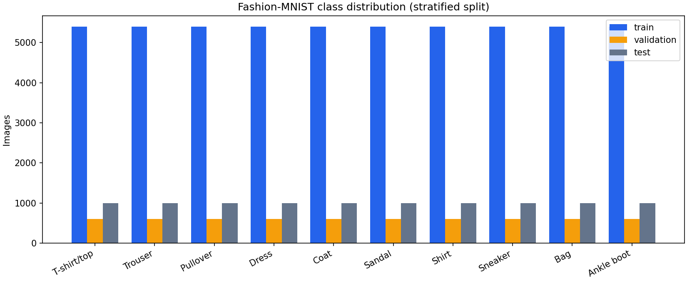
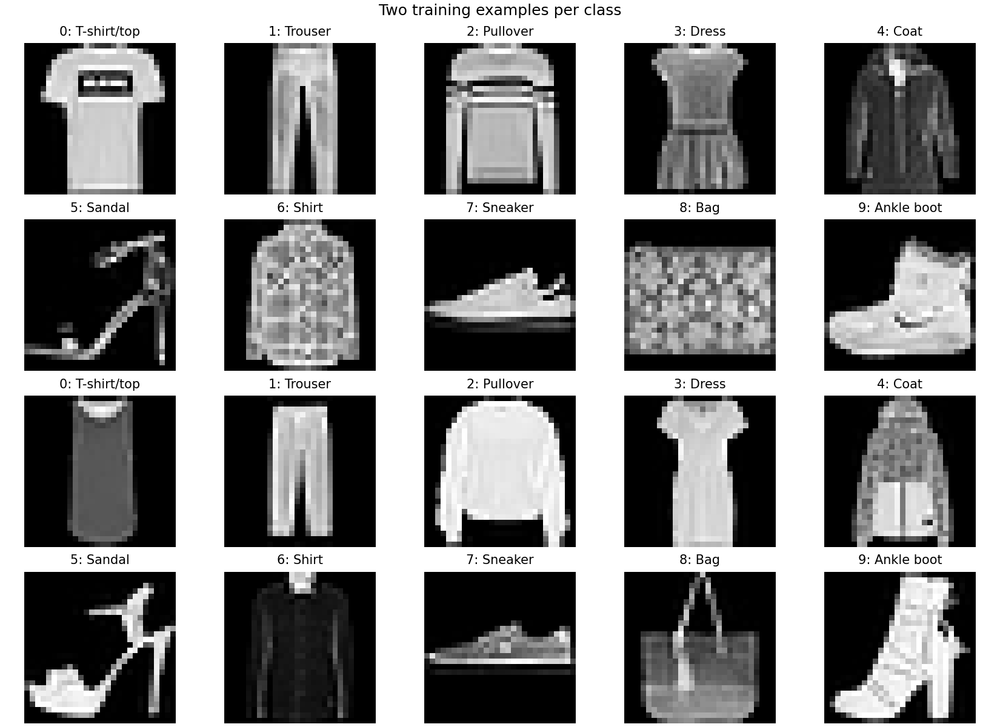
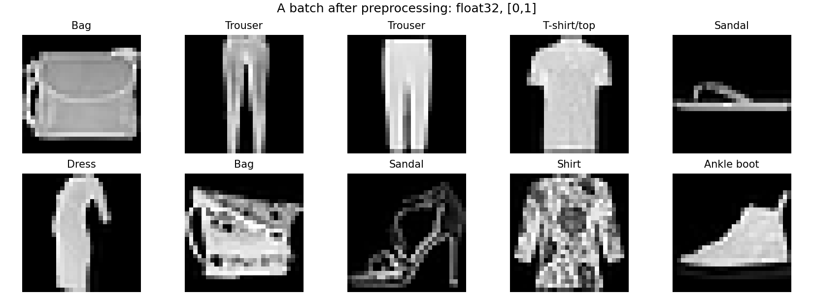
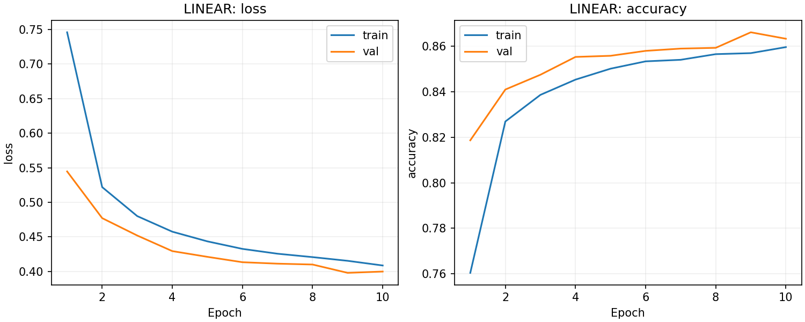
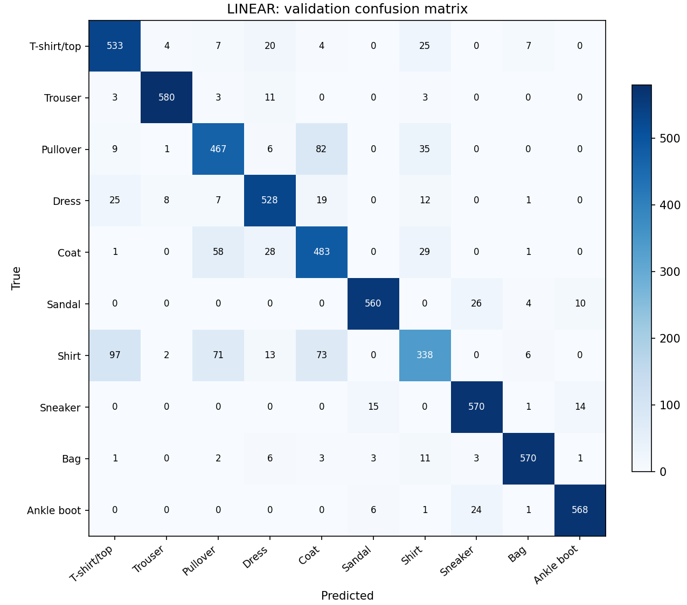
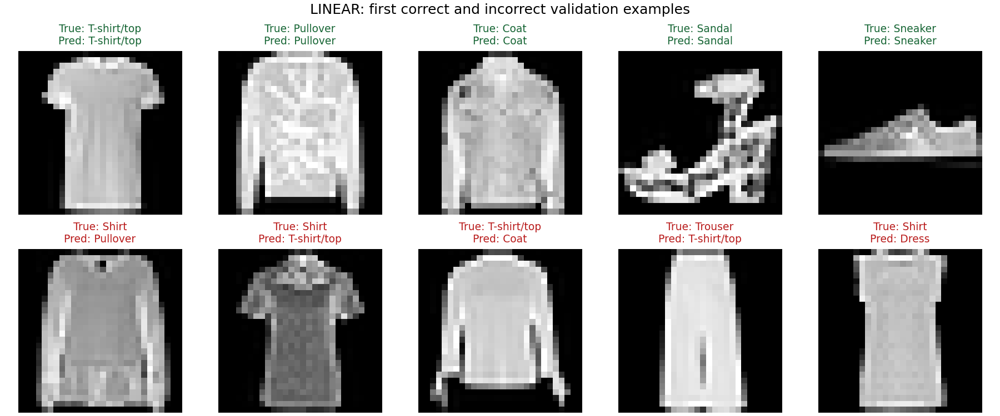
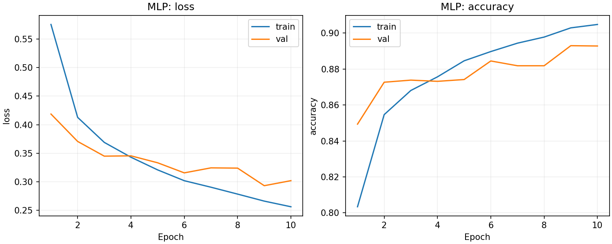
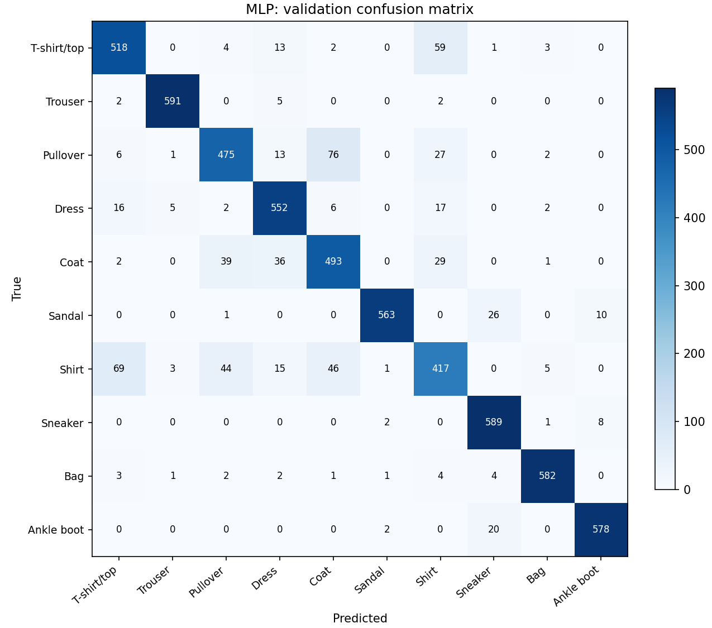
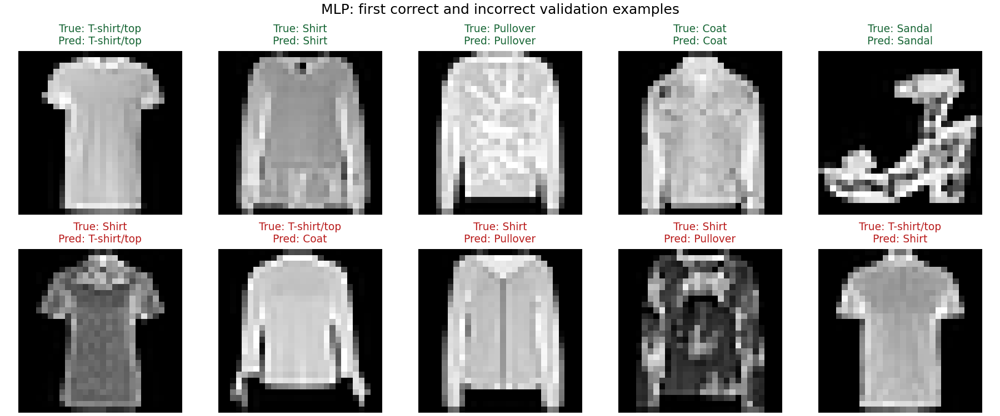

# Assignment 1 - M1 Draft

**Group:** G-M10  
**Course:** CO3133, Semester-261  
**Instructor:** Lê Thành Sách

**Members:** Trần Gia Lâm (2352670); Nguyễn Hữu Cầu (2352129)

> Bản nháp được tạo từ lần chạy code thực tế. Nhóm cần đọc, kiểm chứng và bổ sung phân tích trước khi nộp. Các số dưới đây là validation; chưa phải test.

## Part 1 - Problem and Data Description

Bài toán: từ một ảnh xám của một sản phẩm thời trang, dự đoán một trong 10 lớp. Đơn vị dự đoán là một ảnh; đầu vào có kích thước 1 × 28 × 28, đầu ra là 10 logits. Đây là bài toán phân loại đa lớp, đơn nhãn.

Dữ liệu: [Fashion-MNIST](https://github.com/zalandoresearch/fashion-mnist), do Zalando Research công bố, giấy phép MIT. Ảnh và nhãn được tải dưới dạng IDX nén gzip; torchvision kiểm tra MD5 khi tải. Bản dữ liệu dùng trong lần chạy được nhận diện qua nguồn tải và checksum chuẩn của torchvision.

Chia tập: 54,000 train, 6,000 validation, 10,000 test. Tách stratified từ 60.000 ảnh train chính thức, seed 42; giữ test chính thức độc lập. Chỉ số train/validation không trùng nhau và được lưu trong `split_indices.npz`. Chưa kiểm tra trùng lặp theo nội dung ảnh; kiểm tra chỉ số không thay thế kiểm tra đó.

Xem số lượng chính xác trong [class_counts.csv](eda/class_counts.csv). Các lớp cân bằng về số mẫu trong cách chia này. Ảnh có độ phân giải thấp và chỉ có một kênh; kết quả trên benchmark này chưa chứng minh khả năng tổng quát hóa sang ảnh sản phẩm thực tế.

Tiền xử lý: `ToTensor()` chuyển uint8 [0,255] thành float32 [0,1]. Không augmentation, không chuẩn hóa theo mean/std trong cấu hình baseline này. Dùng Dataset có sẵn của torchvision, Subset để chia tập và DataLoader để tạo batch.

## Part 2 - Methodology

Pipeline: ảnh/nhãn → ToTensor → split và DataLoader → Linear hoặc MLP → CrossEntropyLoss → Adam cập nhật trọng số → validation → chọn checkpoint → argmax và đánh giá.

- Linear: Flatten → Linear(784,10).
- MLP: Flatten → Linear(784,256) → ReLU → Linear(256,10).

Linear dùng phép biến đổi tuyến tính trực tiếp trên pixel đã làm phẳng. MLP thêm hidden layer và ReLU để học quan hệ phi tuyến. Cả hai không có cơ chế tích chập để khai thác trực tiếp cấu trúc không gian cục bộ. Không áp dụng Softmax trước CrossEntropyLoss.

Adam, learning rate 0.001, batch size 128, 10 epochs, seed 42, 4 CPU threads, device cuda. Không scheduler, dropout, weight decay, early stopping hoặc mixed precision. Lưu checkpoint có validation loss thấp nhất; nếu bằng nhau, giữ checkpoint xuất hiện trước.

Thiết kế thí nghiệm: kiểm tra giả thuyết thêm hidden layer phi tuyến cải thiện phân loại. Yếu tố thay đổi là kiến trúc; dữ liệu, split, tiền xử lý, loss, optimizer, learning rate, batch size và số epoch được giữ cố định. Số tham số không được khớp bằng nhau, nên chưa thể quy toàn bộ chênh lệch cho tính phi tuyến. Cấu hình này là điểm khởi đầu, chưa được tìm kiếm siêu tham số.

Code nhóm cần hiểu và kiểm chứng: mô hình, train/validation loop, chọn checkpoint, EDA và tổng hợp kết quả. Thư viện: PyTorch cho layers/autograd/optimizer/loss, torchvision cho dữ liệu và ToTensor, scikit-learn cho split/metrics, matplotlib cho biểu đồ. AI hỗ trợ soạn code; xem AI disclosure.

## Part 3 - Implementation Results

| Model | Val accuracy | Val macro-F1 | Parameters | Best epoch | Train (s) | Inference (ms/image) |
|---|---:|---:|---:|---:|---:|---:|
| linear | 0.8662 | 0.8644 | 7,850 | 9 | 64.62 | 0.000312 |
| mlp | 0.8930 | 0.8924 | 203,530 | 9 | 64.04 | 0.001074 |

MLP trừ Linear: +2.68 điểm phần trăm validation accuracy trong lần chạy này. Cần đọc thêm macro-F1, số tham số và thời gian để đánh giá sự đánh đổi. Đây là một seed; chưa có mean/std nhiều lần chạy hoặc kết luận về ý nghĩa thống kê.

Training time trong bảng gồm nạp batch, forward/backward, cập nhật và thu metric; không gồm validation. Inference là thời gian forward thuần, input đã ở device, batch 128, warm-up 10 batch, đo 50 batch; ms/image là giá trị chia trung bình theo batch. Không diễn giải nó thành độ trễ một yêu cầu đơn ảnh hoặc thời gian toàn pipeline.

### LINEAR

Các cặp nhầm nhiều nhất trên validation (số liệu thực tế):

- Shirt → T-shirt/top: 97 ảnh (16.2% số ảnh của lớp thật).

- Pullover → Coat: 82 ảnh (13.7% số ảnh của lớp thật).

- Shirt → Coat: 73 ảnh (12.2% số ảnh của lớp thật).

- Shirt → Pullover: 71 ảnh (11.8% số ảnh của lớp thật).

- Coat → Pullover: 58 ảnh (9.7% số ảnh của lớp thật).

Máy chạy: Intel(R) Xeon(R) CPU @ 2.00GHz; device cuda. Xem cấu hình, phiên bản, fingerprint code, thời gian và checkpoint trong [linear/metrics.json](linear/metrics.json).

### MLP

Các cặp nhầm nhiều nhất trên validation (số liệu thực tế):

- Pullover → Coat: 76 ảnh (12.7% số ảnh của lớp thật).

- Shirt → T-shirt/top: 69 ảnh (11.5% số ảnh của lớp thật).

- T-shirt/top → Shirt: 59 ảnh (9.8% số ảnh của lớp thật).

- Shirt → Coat: 46 ảnh (7.7% số ảnh của lớp thật).

- Shirt → Pullover: 44 ảnh (7.3% số ảnh của lớp thật).

Máy chạy: Intel(R) Xeon(R) CPU @ 2.00GHz; device cuda. Xem cấu hình, phiên bản, fingerprint code, thời gian và checkpoint trong [mlp/metrics.json](mlp/metrics.json).

### Phân tích cần nhóm bổ sung

1. Đọc hai learning curves: từ epoch nào validation dừng cải thiện trong khi train tiếp tục cải thiện?
2. Chọn ít nhất hai ảnh dự đoán sai, mô tả chi tiết nhìn thấy và đưa ra giả thuyết nguyên nhân.
3. Giải thích accuracy, macro-F1 và trade-off tốc độ/số tham số của hai mô hình.
4. Ghi lỗi triển khai thực sự gặp và cách sửa; nếu không có, ghi rõ.

### Giới hạn và kế hoạch Final

Draft mới có Linear và MLP, một seed và một cấu hình. Test chưa được đánh giá. Tiếp theo triển khai CNN tự thiết kế, LSTM hoặc GRU, Transformer; mở rộng so sánh, phân tích biểu diễn/inductive bias và kiểm tra test sau khi chốt lựa chọn bằng validation. Hoàn thiện báo cáo, slides, video và các liên kết theo handbook.

### AI Usage Disclosure

ChatGPT hỗ trợ tạo code, cấu trúc báo cáo và hướng dẫn. Bản báo cáo này lấy số từ metric thật; các nhận xét mang tính giả thuyết cần nhóm kiểm chứng. Nhóm phải điền người sử dụng, prompt, thời điểm, phần bị ảnh hưởng, cách kiểm chứng và người chịu trách nhiệm vào AI_USAGE.md. Chưa xác nhận kiểm chứng bởi thành viên nhóm tại thời điểm sinh tự động.

### Tài liệu tham khảo

- Course Project Handbook CO3133, revision 14 September 2026, mục 3, 5, 7.4 và Part II.
- [Fashion-MNIST dataset](https://github.com/zalandoresearch/fashion-mnist).
- [PyTorch Quickstart](https://docs.pytorch.org/tutorials/beginner/basics/quickstart_tutorial.html).
